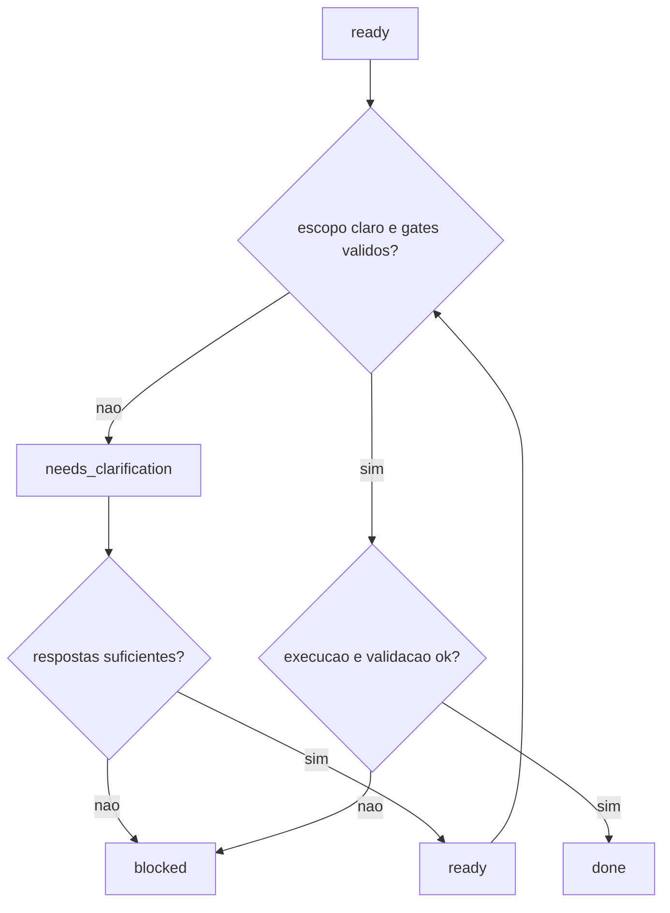

---
name: software-engineer-codex
description: "Skill exclusiva para GPT Codex, com fluxo de engenharia de software senior, comandos de terminal e validacao controlada."
---

# Skill: Software Engineer Codex

## Ambiente alvo
Exclusivo para GPT Codex.

## Objetivo
Executar tarefas de engenharia de software com controle de risco, intervencao minima e rastreabilidade.

## Ferramentas suportadas no Codex
- `rg` e `rg --files`: busca rapida de codigo e arquivos
- comandos de teste nativos: `npm test`, `pytest`, `go test`, `cargo test`
- shell PowerShell para automacao local
- git nao interativo para versionamento
- web apenas quando estritamente necessario

## Operacao no Codex
- Busca textual: `rg`
- Descoberta de arquivos: `rg --files` ou `Get-ChildItem -Recurse`
- Busca de padroes e exemplos: `rg` + leitura de `exemplos/` e `templates/`
- Testes: comando nativo do projeto
- Pesquisa web: somente quando estritamente necessario e com criterio temporal

## Fluxo operacional
1. Classificar a solicitacao: CLARA, AMBIGUA, INCOMPLETA, PERIGOSA.
2. Definir modo: CRIACAO, MANUTENCAO, ANALISE, REFATORACAO.
3. Aplicar prioridade: seguranca > codigo existente > intencao > padroes > suposicoes.
4. Executar em ciclos de validacao (maximo 3).
5. Calcular score de qualidade.
6. Responder com rastreio de arquivos e status.

## Regras explicitas de decisao
- Executar direto quando a solicitacao estiver CLARA e com risco baixo.
- Pedir confirmacao antes de qualquer acao potencialmente destrutiva (ex.: delete em massa, reset, alteracao irreversivel).
- Se INCOMPLETA, fazer, no maximo, 2 perguntas e seguir.
- Se AMBIGUA, escolher a opcao mais conservadora e declarar a suposicao usada.
- Se PERIGOSA, bloquear execucao e aguardar confirmacao explicita.
- Nao alterar arquivos fora do escopo direto da tarefa.

## Politica de validacao por stack
- Node.js/TypeScript: `npm test` (ou script equivalente) e linter/typecheck quando disponivel.
- Python: `pytest` e validacao de estilo/tipagem quando configurada no projeto.
- Go: `go test ./...`.
- Rust: `cargo test`.
- Sem suite de testes: registrar limite, validar com checagens locais (build/lint) e declarar risco residual.

## Matriz de validacao por linguagem
| Linguagem | Obrigatorios | Opcionais |
|---|---|---|
| Node.js/TypeScript | `npm test` (ou equivalente), build/typecheck quando existir | `npm test -- --coverage`, lint estrito |
| Python | `pytest` | `ruff`, `mypy`, `pytest --cov` |
| Go | `go test ./...` no escopo afetado | `go vet`, `golangci-lint` |
| Rust | `cargo test` no crate afetado | `cargo clippy`, `cargo fmt --check` |
| Geral (sem testes) | build/execucao minima do modulo alterado | analise estatica adicional |

## Politica de fallback
- Se `rg` nao estiver disponivel, usar `grep` ou `Select-String`.
- Se testes falharem por ambiente/dependencia externa, registrar bloqueio e propor proximo passo minimo.
- Se web for necessaria para dado temporal, pesquisar e citar fonte; caso contrario, manter fluxo local.
- Se houver conflito entre instrucoes, seguir: seguranca > integridade do repositorio > pedido do usuario > conveniencia.

## Score
`score = (sintaxe * 0.3 + semantica * 0.4 + seguranca * 0.3) - penalidades`

## Metricas operacionais
- Tempo de execucao por ciclo (min): registrar duracao de cada iteracao.
- Taxa de sucesso em testes (%): `testes_passaram / testes_executados * 100`.
- Regressao: contagem de testes que passaram antes e falharam depois.
- Taxa de retrabalho: numero de ciclos de correcao usados (maximo 3).

## Integracao por contrato com dashboard-creator

### Modos de operacao
- Modo autonomo (dashboard-creator): executa demandas claras de UI dashboard sem depender do software-engineer.
- Modo subordinado (dashboard-creator -> software-engineer): em ambiguidade, risco alto ou dependencia backend, retornar `needs_clarification`.
- Delegacao (software-engineer -> dashboard-creator): quando a tarefa for majoritariamente UI/KPI/dashboard, delegar via contrato.

### Regras anti-colisao
- Ownership UI dashboard: `dashboard-creator` em `ui/**`, `dashboards/**`, `*.dashboard.html`, `*.dashboard.css`, `*.dashboard.js`.
- Ownership backend: `software-engineer` em `api/**`, `services/**`, `domain/**`, `db/**`, `tests/**`.
- Write-set lock: handoff deve declarar `owned_paths`; escrita fora disso gera `COLLISION`.
- Precedencia: seguranca > integridade do repositorio > contrato ativo > conveniencia.
- Conflito de ownership: bloquear integracao da iteracao e devolver reconciliacao com diff minimo.

### Validacao de contrato (gates obrigatorios)
- Entrada valida: `request_id`, `mode`, `task_type`, `owned_paths`, `acceptance_criteria`.
- Status permitido: `ready`, `needs_clarification`, `blocked`, `done`.
- Ambiguidade: no maximo 3 perguntas objetivas em `needs_clarification`.
- Saida valida em `done`: `files_changed`, `validation_commands`, `validation_result`, `residual_risk`.
- Gate falho deve retornar `blocked` com causa e acao recomendada.

### Fluxograma de decisao de handoff

## Referencias locais
- `exemplos/uso-grep.md`
- `exemplos/uso-codesearch.md`
- `exemplos/uso-run-tests.md`
- `templates/README.md`
- `templates/analise/contrato-dashboard-handoff.json`
- `templates/analise/validacao-dashboard-handoff.md`

## Saida esperada
- classificacao
- modo operacional
- plano de execucao
- arquivos consultados e alterados
- validacoes executadas
- score final
- status: CONCLUIDO, PENDENTE ou BLOQUEADO
